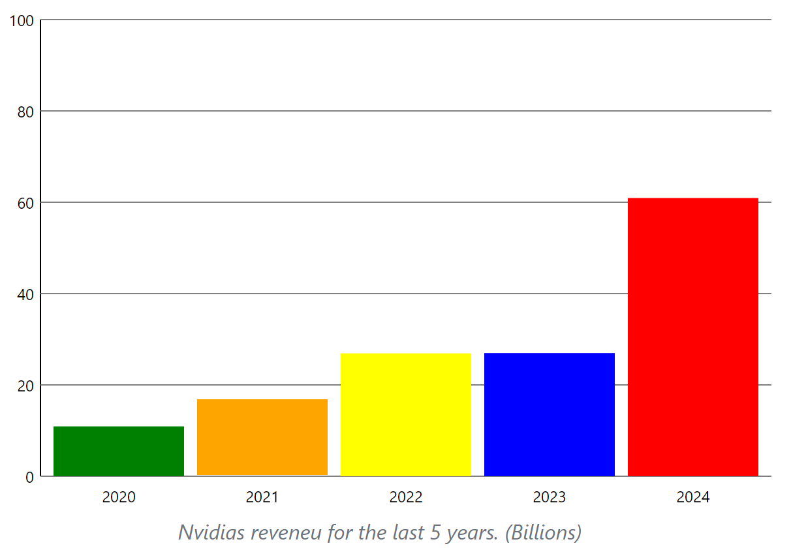
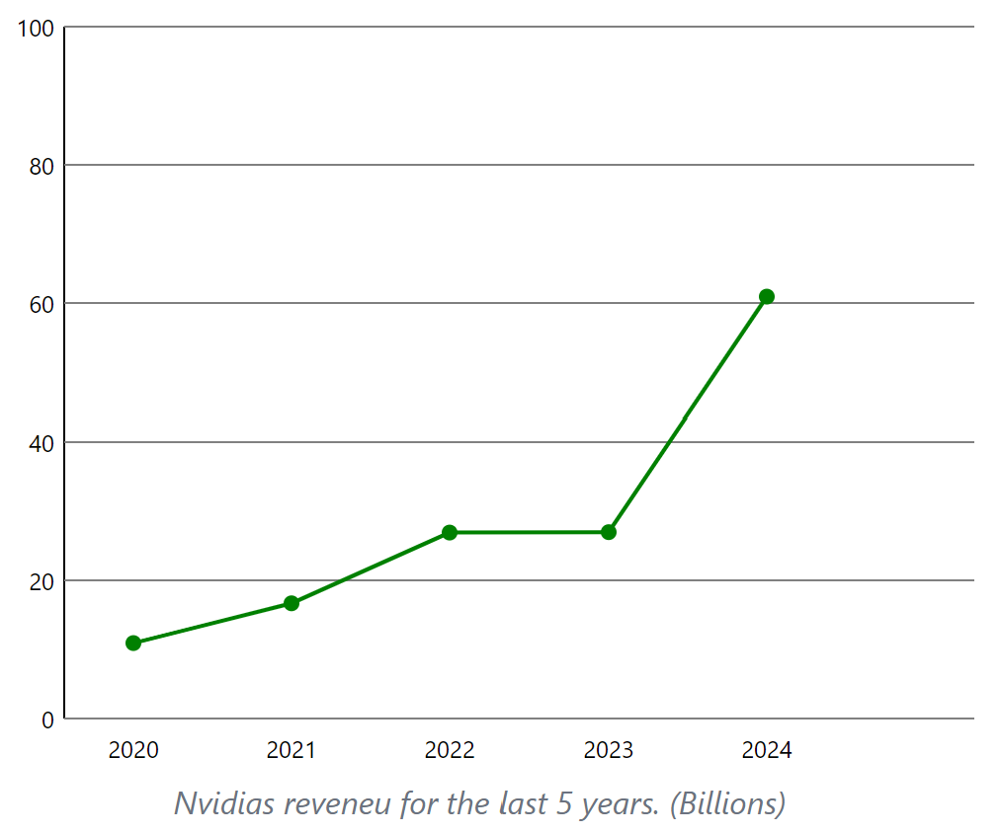
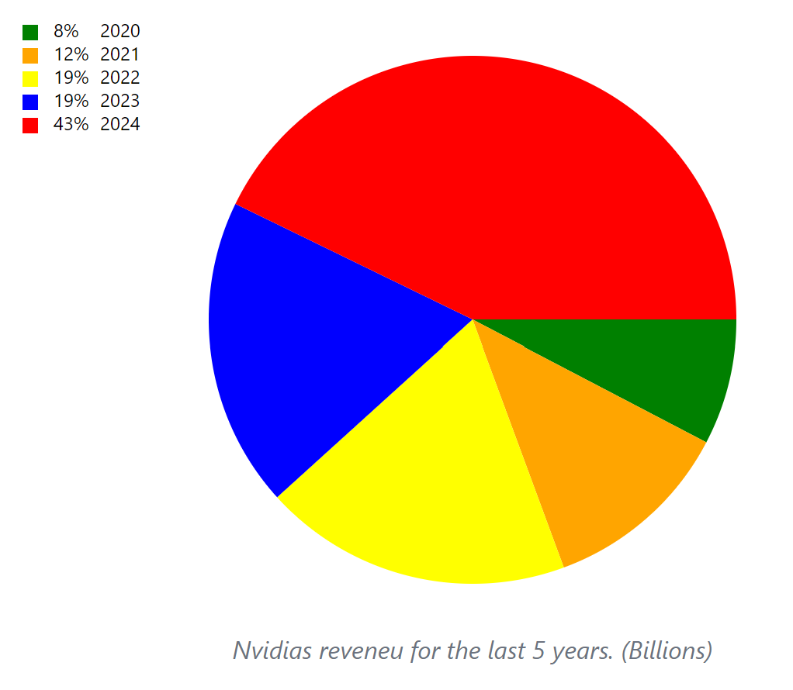
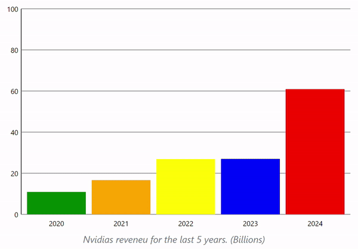
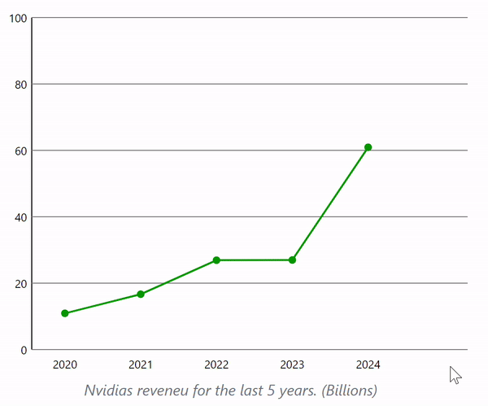
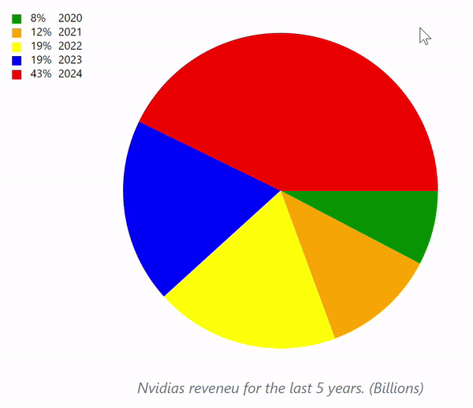

# DiagramFactory

## Description
The DiagramFactory library allows users to create dynamic and interactive diagrams using SVG (Scalable Vector Graphics). It supports:

- **Bar Diagrams** (horizontal and vertical) for comparing categorical data.
- **Line Diagrams** for showing trends over time.
- **Circle Diagrams** (Pie Charts) for visualizing proportional data.

The library is fully customizable with options for colors, labels, animations, and interactivity, making it a great solution for data visualization in web applications.






## Installation
1. Clone the repository or download the DiagramFactory library.

2. Include the library in your project:
```html
  <svg id="svgDiagram" width="600" height="400"></svg>
```

3. Import the library into your JavaScript file:
```javascript
import { DiagramFactory } from './lib/DiagramFactory/DiagramFactory.js'
```
## Usage Example
1. Heres a complete example of creating a Bar Diagram with interactivity and animation:
```html
<svg id="svgDiagram" width="600" height="400"></svg>
```

```javascript
const diagramFactory = new DiagramFactory({
  elementId: '#svgDiagram',
  data: [
    { label: 'A', value: 10, color: 'blue' },
    { label: 'B', value: 20, color: 'red' },
    { label: 'C', value: 100, color: 'green' },
    { label: 'D', value: 40, color: 'yellow' }
  ],
  interactivity: {
    expand: true,
    infoBoxWhenHover: true
  },
  animation: {
    speed: 100
  },
  decoration: {
    showGrid: false
  }
})

diagramFactory.createBarDiagram()
```

You can easily switch the diagram type:
```javascript
diagramFactory.createCircleDiagram()
diagramFactory.createLineDiagram()
```

## Configuration Options
### Required:
- **elementId**: The ID of the SVG element where the diagram will be rendered.
- **data**: An array of objects representing the data points, each with:
  - ``label``: The category or label of the data.
  - ``value``: The numerical value of the data point.
  - ``color``: The color for that data point.

### Optional:
- **interactivity**:
  - ``expand``: Boolean, if true, elements expand when hovered.
  - ``infoBoxWhenHover``: Boolean, if true, displays an info box on hover.
- **animation**:
  - ``speed``: Sets the animation speed (ms).
- **decoration**:
  - ``showGrid``: Boolean, shows grid lines in the background if true.

## Screenshots






## Dependencies
This module primmarily relies on built-in browser features and the SVG (Scalable Vector Graphics) standard for rendering the diagrams. It does not have any external dependencies or require additional libraries to function.

## Language
The DiagramFactory library is written in `JavaScript` (ES6) and utilizes modern language features such as classes, arrow functions, and template literals. It is designed to be compatible with modern web browsers and can be easily integrated into web applications using ES6 modules.

## Version
The current version of the DiagramFactory library is `1.0.0`. Future updates and enhancements may be released to improve functionality, performance, and compatibility with different browsers and devices. In future versions, additional diagram types and customization options may be added to provide more flexibility and control over the visualizations.

This project uses **Semantic Versioning**. Each version follows the format:

- **MAJOR**: Incompatible API changes.
- **MINOR**: Backward-compatible new functionality.
- **PATCH**: Backward-compatible bug fixes.

For more information about Semantic Versioning, visit [SemVer.org](https://semver.org).


## Bugreports

### Known Issues
| Issue ID | Description | Status | Priority | Remarks |
|----------|-------------|--------|----------|---------|
| BUG001 | The CircleDiagram does not have the ability to expand. | open | minor | Requires update to interaction logic |
| BUG002 | The Labels does not fit good with the circle diagram when the space is to small | open | minor | Suggest resizing or using smaller labels |
| BUG003 | The CircleDiagram will not render when only one data has been added | open | m | - |


We welcome all users to submit issues for bug reports, feature requests, or general feedback. Please visit our [GitHub Issues page](https://github.com/Witten2002/DiagramFactory/issues) to create a new issue or comment on an existing one.

Steps to submit an issue:
1. Go to the [Issues page](https://github.com/Witten2002/DiagramFactory/issues).
2. Click "New Issue."
3. Provide a detailed description, steps to reproduce the issue, and any relevant screenshots or code snippets.

Make sure to check existing issues before submitting a new one!

## Contributing
We welcome contributions! If you'd like to contribute to this project, follow these steps:

1. Fork the repository.
2. Create a new branch (e.g., `feature/new-feature`).
3. Make your changes and commit them.
4. Submit a pull request to the `main` branch.

Please ensure all changes are tested before submitting.

For more details on the coding standard, you can refer to the official LNU guidelines [here](https://www.npmjs.com/package/@lnu/eslint-config).

## License

This project is licensed under the MIT License - see the [LICENSE](./LICENSE) file for details.

## Acknowledgments
The DiagramFactory library was developed as part of a project for the course "Web Development" at Linnaeus University. The project aimed to create a reusable library for generating interactive diagrams using SVG and JavaScript. The library was developed by Ludwig Wittenberg and is intended for educational purposes and as a learning resource for web developers.

***After the course is ended the library will no longer be maintained and updated.***

## Testrapport
The DiagramFactory library has been tested using a combination of manual and automated testing methods to ensure that the diagrams are rendered correctly and that the interactivity and animations function as expected. The automated tests are written using the Jest testing framework and cover a range of scenarios to validate the library's behavior under different conditions. The automated test check if the configuration object is valid and if the diagram is rendered correctly. The manual tests involve visual inspection of the diagrams to verify that they match the expected output based on the provided data and configuration.

[Full TestRapport](https://github.com/Witten2002/1dv610-Labboration-2/blob/main/TestRapport.md)
